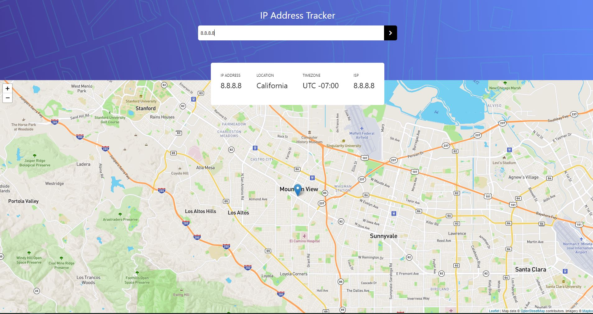

## IP Tracker

Full-stack IP tracker that utilizes both the MapBox and Geo-ipify APIs, to place down a map market and also reposition the map to center around the given IP address, respectively. Vue is used to build the front-end, Node for the backend, as well as Tailwind CSS for styling, and Leaflet.js for rendering the map.

### Built with:

Vue.js	Tailwind.css	Node.js	Leaflet.js	2x APIs

## Live

<a href='https://iptracker.live/' target='_blank'>IP Tracker</a>

## Project Screen Shot

